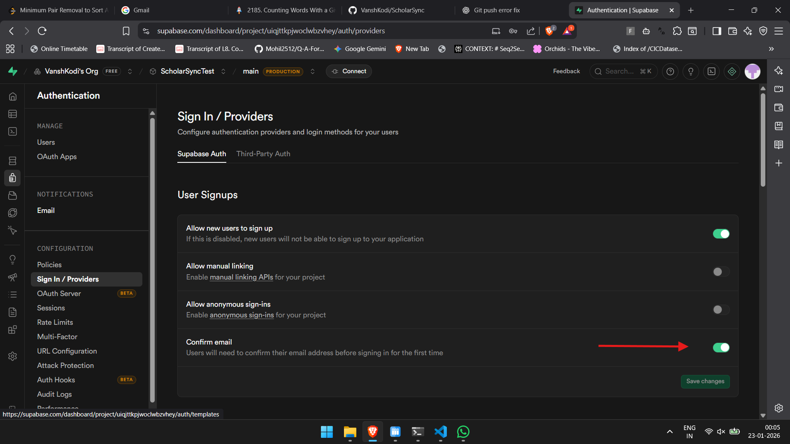
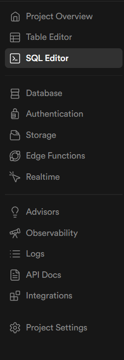

# SETUP.md — ScholarSync Local Setup Guide

This document describes how to set up **ScholarSync** locally using Supabase, FastAPI, and a vanilla HTML/CSS/JavaScript frontend.

> ⚠️ Supabase UI, settings, and key locations may change over time. Some steps may vary depending on the current Supabase version.

---

## STEP 1: Clone the Repository

Clone the project repository to your local machine:

    git clone https://github.com/VanshKodi/ScholarSync

---

## STEP 2: Supabase Project Creation

1. Create a **new Supabase project**
2. Navigate to:
   Authentication → Configuration → Sign In / Providers
3. Disable **Confirm Email** to simplify local authentication

---

## STEP 3: Database Setup

1. Open the file: `backend/db_schema.md`
2. Copy its entire contents
3. Go to **Supabase → SQL Editor**
4. Paste the schema and execute it

This initializes all required database tables.

---

## STEP 4: Environment Variables & API Keys

> ⚠️ Key locations may change in future Supabase updates.

1. Inside the `backend` directory, create a `.env` file
2. Add the following variables:

    SUPABASE_URL=
    
    SUPABASE_SERVICE_ROLE_KEY=

### Key Sources

- SUPABASE_URL  
  Project Settings → Data API

- SUPABASE_SERVICE_ROLE_KEY  
  Project Settings → API Keys → Legacy anon / service_role

⚠️ **Never expose the service role key on the frontend.**

---

## STEP 5: Install Live Server (VS Code)

- Install the **Live Server** extension from the VS Code Marketplace

---

## STEP 6: Run the Frontend

1. Open `frontend/index.html` in VS Code
2. Start **Live Server**

Frontend will be available at:
http://127.0.0.1:5500

---

## STEP 7: Backend Setup

Install Python dependencies:

    pip install -r backend/requirements.txt

Start the backend server:

cd .\backend\
uvicorn main:app --reload --port 8000

Backend will run at:
http://127.0.0.1:8000

---

## STEP 8: Authentication URL Configuration

In Supabase, navigate to:
Authentication → Configuration → URL Configuration

Add the following URLs:

    http://127.0.0.1:5500
    http://127.0.0.1:8000

---

## STEP 9: Storage Buckets Setup

- Create the required **Storage Buckets** in Supabase
- These buckets are used to store uploaded documents

---

## Final Status

At this point:
- Frontend is running
- Backend is running
- Database is initialized
- Authentication is configured
- Storage is ready
